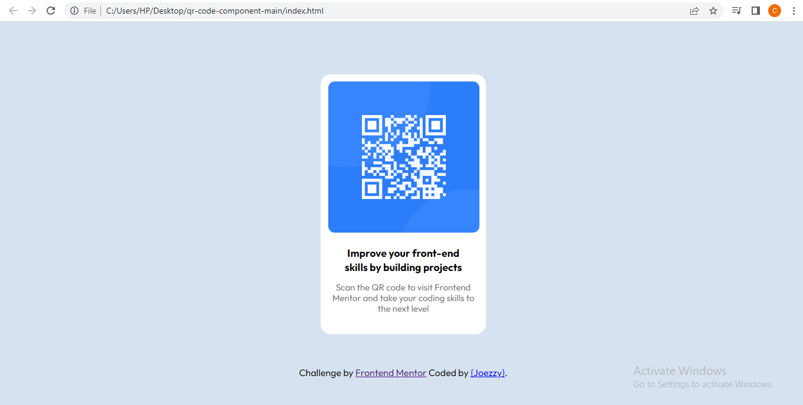

# Frontend Mentor - QR code component solution

This is a solution to the [QR code component challenge on Frontend Mentor](https://www.frontendmentor.io/challenges/qr-code-component-iux_sIO_H). Frontend Mentor challenges help you improve your coding skills by building realistic projects. 

## Overview
  This is a basic HTML and CSS solutioin to the QR code component challenge on Frontend Mentor. 
### Screenshot




### Links

- Solution URL: [Check] (https://github.com/Joezzyongit/qr-code-component.git)
- Live Site URL: [Click Me](https://joezzyongit.github.io/qr-code-component/)

### Built with

- Semantic HTML5 markup
- CSS custom properties

### What I learned
I learnt how to make good use of @media screen size i normally used to struggle with it but thanks to this
challenge things are different now.

Through this project i gained knowledge on how to structure a div with contents inside.

Highlighting my codes with comments was so fun.


```css
.proud-of-this-css {
  font-family: 'Outfit', sans-serif;
}
```

### Continued development
I will love to learn more about CSS Flex Box and Grid, heared about CSS3 i will look more into it.

Currently learning Javascript hoping the best for the future.

## Author

- Frontend Mentor - [@Joezzyongit](https://www.frontendmentor.io/profile/@Joezzyongit)
- Twitter - [@Tyrex_on](https://www.twitter.com/Tyrex_on)
